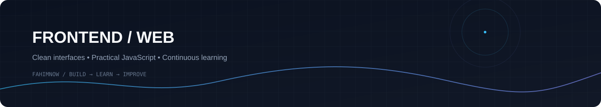

<div align="center">

# MD. FAHIM ISLAM

**Frontend Developer · JavaScript · Modern Web**

Building clean, responsive and interactive web experiences.

<br>

<a href="https://github.com/fahimnow">
  
</a>
<a href="https://www.linkedin.com/in/fahimnow/">
  
</a>
<a href="https://fahimnow.github.io/personal-portfolio/">
  
</a>

<br><br>



</div>

---

## About

I'm **MD. Fahim Islam**, a Frontend Developer with a background in Computer Science & Engineering and a major in **Information Systems**.

I build responsive interfaces and interactive web applications with a focus on clean UI, practical JavaScript, API integration and continuous improvement.

```text
Frontend Development
        ↓
HTML · CSS · JavaScript
        ↓
Responsive UI · APIs · Interactive Experiences
        ↓
Build → Learn → Improve
```

---

## Tech Stack

<div align="center">


<br><br>

`HTML5` · `CSS3` · `JavaScript` · `Tailwind CSS` · `DaisyUI`  
`Git` · `GitHub` · `REST APIs` · `Responsive Web Design`

<br><br>

**AI-assisted development · Modern UI development**

</div>

---

## Featured Projects

<table>
<tr>
<td width="50%" valign="top">

### Payoo

**Mobile Banking Interface**

`HTML` `Tailwind CSS` `DaisyUI` `JavaScript`

Responsive banking interface with add money, cash out, transfers, bill payments and transaction history.

**[Live Demo](YOUR_PAYOO_LIVE_URL)** · **[Code](YOUR_PAYOO_REPO_URL)**

</td>

<td width="50%" valign="top">

### English Janala

**Interactive Vocabulary Platform**

`HTML` `CSS` `JavaScript` `REST API`

Dynamic lessons and vocabulary cards with API integration, pronunciation, meanings and active lesson states.

**[Live Demo](YOUR_JANALA_LIVE_URL)** · **[Code](YOUR_JANALA_REPO_URL)**

</td>
</tr>

<tr>
<td width="50%" valign="top">

### Emergency Hotline

**Emergency Service Interface**

`HTML` `CSS` `JavaScript`

Interactive emergency cards with heart count, copy interaction, calling functionality and call history.

**[Live Demo](YOUR_HOTLINE_LIVE_URL)** · **[Code](YOUR_HOTLINE_REPO_URL)**

</td>

<td width="50%" valign="top">

### Bankist

**Interactive Banking Landing Page**

`HTML` `CSS` `JavaScript`

A modern banking interface focused on JavaScript interactions, DOM manipulation and frontend UI.

**[Live Demo](YOUR_BANKIST_LIVE_URL)** · **[Code](YOUR_BANKIST_REPO_URL)**

</td>
</tr>

<tr>
<td width="50%" valign="top">

### Fried Chicken

**Responsive Restaurant Website**

`HTML` `CSS` `JavaScript` `ScrollReveal`

Responsive restaurant experience with interactive sections and scroll-based visual effects.

**[Live Demo](YOUR_FOOD_LIVE_URL)** · **[Code](YOUR_FOOD_REPO_URL)**

</td>

<td width="50%" valign="top">

### Guess My Number

**JavaScript Browser Game**

`HTML` `CSS` `JavaScript`

Interactive game demonstrating JavaScript logic, events, DOM manipulation and user interaction.

**[Live Demo](YOUR_GUESS_LIVE_URL)** · **[Code](YOUR_GUESS_REPO_URL)**

</td>
</tr>
</table>

---

## GitHub Activity

<div align="center">


<br>


</div>

---

## Contribution Activity

<div align="center">


</div>

---

## Education

**BSc in Computer Science & Engineering**  
American International University–Bangladesh (AIUB)  
**Major:** Information Systems ·

---

## Current Direction

```text
Frontend Development
JavaScript
Responsive & Accessible UI
API Integration
Modern Web Development
AI-assisted Development
```

I'm continuing to strengthen my frontend fundamentals through practical projects and modern development workflows.

---

## Connect

<div align="center">

<a href="https://github.com/fahimnow">GitHub</a>
&nbsp; · &nbsp;
<a href="https://www.linkedin.com/in/fahimnow/">LinkedIn</a>
&nbsp; · &nbsp;
<a href="https://fahimnow.github.io/personal-portfolio/">Portfolio</a>
&nbsp; · &nbsp;
<a href="mailto:fahimislam222@gmail.com">Email</a>

<br><br>

<sub>Build clean. Learn continuously. Improve consistently.</sub>

</div>
